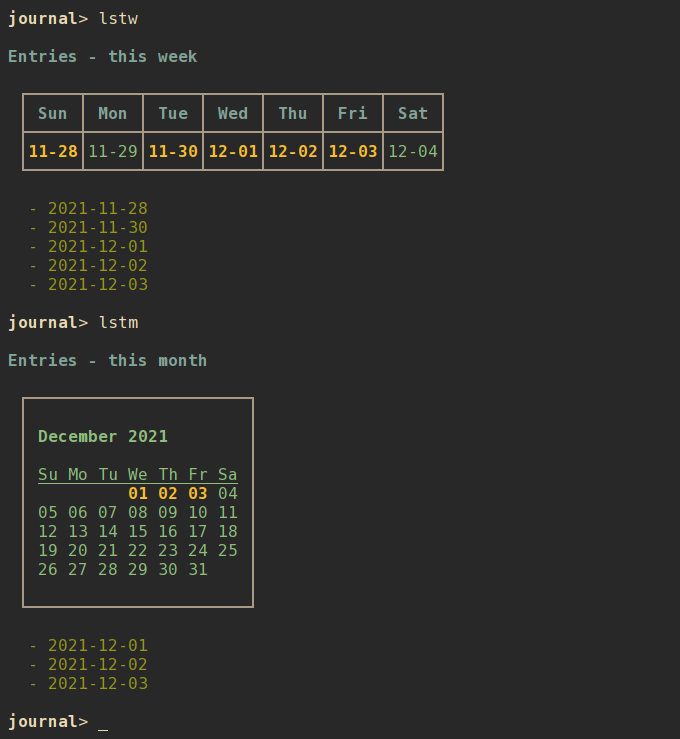

# nrrdjrnl

A terminal-based journal management program with search and list options, and data stored in local text files.

## Contents

- [Getting nrrdjrnl](#getting-nrrdjrnl)
    - [Downloading](#downloading)
    - [Python dependencies](#python-dependencies)
    - [Installing](#installing)
        - [Setuptools](#setuptools)
        - [Make](#make)
- [Using nrrdjrnl](#using-nrrdjrnl)
    - [Basic usage](#basic-usage)
    - [Command-line usage](#command-line-usage)
        - [Listing entries](#listing-entries)
        - [Viewing or editing an entry](#viewing-or-editing-an-entry)
        - [Creating a new entry](#creating-a-new-entry)
        - [Deleting an entry](#deleting-an-entry)
        - [Archiving an entry](#archiving-an-entry)
        - [Searching entries](#searching-entries)
        - [Paging](#paging)
    - [Interactive shell](#interactive-shell)
        - [A note about refresh](#a-note-about-refresh)
    - [Configuration](#configuration)
        - [Default configuration](#default-configuration)
        - [Alternate configuration](#alternate-configuration)
        - [Editing configuration](#editing-configuration)
        - [Main configuration options](#main-configuration-options)
        - [Color configuration options](#color-configuration-options)
    - [Sample today script](#sample-today-script)

## Getting `nrrdjrnl`
### Downloading
To download `nrrdjrnl` simply clone this repository:

    git clone https://github.com/sdoconnell/nrrdjrnl.git

### Python dependencies
`nrrdjrnl` requires Python 3.8+ and the following Python 3 libraries to be available:

- `rich`
- `watchdog`
- `dateutil`
- `tzlocal`

You may install these dependencies from your Linux distribution's repos (if available) or via `pip` using the `requirements.txt` file provided in this repository:

    pip install -r requirements.txt

### Installing
You may install the application one of two ways: via `setuptools`, or via `make`. Installing via `make` will also install the manpage for `nrrdjrnl(1)` and will copy the `README.md` file into your system documentation directory.

#### Setuptools
Run the `setup.py` script to install system-wide (likely requires `su` or `sudo`):

    sudo python3 setup.py install

Alternatively, you may install the package to your `$HOME` directory.

    python3 setup.py install --user

#### Make
Use `make` to install the application system-wide (likely requires `su` or `sudo`):

    sudo make install

There is also an `uninstall` operation available:

    sudo make uninstall

## Using `nrrdjrnl`
### Basic usage
`nrrdjrnl` is a terminal-based application that can be run in either of two modes: command-line or interactive shell.

    nrrdjrnl -h
    usage: nrrdjrnl [-h] [-c <file>] for more help: nrrdjrnl <command> -h ...

    Terminal-based journal management for nerds.

    commands:
      (for more help: nrrdjrnl <command> -h)
        delete (rm)         delete an entry file
        list (ls)           list entries
        open                open a journal entry
        search              search entries
        shell               interactive shell
        version             show version info

    optional arguments:
      -h, --help            show this help message and exit
      -c <file>, --config <file>
                            config file

### Command-line usage
#### Listing events
There are many options for listing your journal entries:

- `list thisweek` (or `lstw`) : list all entries for this week.
- `list lastweek` (or `lspw`) : list all entries for last week.
- `list thismonth` (or `lstm`) : list all entries for this month.
- `list lastmonth` (or `lspm`) : list all entries for last month.
- `list thisyear` (or `lsty`) : list all entries for this year.
- `list lastyear` (or `lspy`) : list all entries for last year.
- `list custom` (or `lsc`) : list all entries for a date range.

#### Viewing or editing an entry
You may view or edit an entry by using the `open` command and supplying one of:

- `today`
- `yesterday`
- the entry's date (`YYYY-MM-DD`)

The shortcut for `open today` is `otd`. The shortcut for `open yesterday` is `opd`.

Examples:

    nrrdjrnl open 2021-12-01
    nrrdjrnl open today
    nrrdjrnl opd

The journal file is opened in the text editor defined by the `$EDITOR` environment variable. When opening the journal file for the current day (`open today`) any editor options specified in the `today_options` configuration option will be provided to `$EDITOR`.

#### Creating a new entry
Using the `open today` command will automatically create a new journal entry for the current day, populated with the contents of the file specified by the `today_template` configuration option. If you use the `open <date>` command and a journal file does not exist for that date, `nrrdjrnl` will prompt to ask if you'd like to create a new file (using the default template).

    » nrrdjrnl open 2019-05-25
    Entry for 2019-05-25 doesn't exist.
    Would you like to create an entry for 2019-05-25? [N/y]: y

#### Deleting an entry
Use the `delete` subcommand to delete an entry. Confirmation will be required for this operation unless the `--force` option is also used.

    nrrdjrnl delete <date> [--force]

#### Searching entries
`nrrdjrnl` supports simple keyword/phrase text searches, as well as regular expression searches. Search results are shown in the same format as a `list custom` view, but with included excerpts for search matches. For regular expression searches, enclose the search term in `/` (i.e., `/<regex to search for>/`.

#### Paging
Output from `list` and `search` can get long and run past your terminal buffer. You may use the `-p` or `--page` option in conjunction with `search` and `list` to page output.

### Interactive shell
`nrrdjrnl` also features an interactive mode, enabled by `shell`. This mode offers commands similar to the command-line options, but in a persistent shell-like environment.

Most commands are similar to their command-line argument analogs:

- `list <view>` (or `lsc`, `lstw`, `lspw`, `lstm`, `lspm`, `lsty`, `lspy`)
- `config`
- `open`
- `delete <date>` (or `rm <date>`), confirmation is always required (no `--force`).
- `search <term>`
- `help [command]`

A couple of additional shell-specific commands exist:
- `clear` : clear the shell output.
- `refresh` : re-read the entry files on disk if edits were made outside of `nrrdjrnl`.

#### A note about `refresh`
When editing journal entries or using `delete`, it is **not** necessary to perform a manual `refresh` afterward. This is done automatically when the previous operation is completed. In general, a manual `refresh` should not be needed but the functionality is included to cover edge cases.
 
### Configuration
#### Default configuration
By default, `nrrdjrnl` reads its configuration from a config file located at either `$XDG_CONFIG_HOME/nrrdjrnl/config` or `$HOME/.config/nrrdjrnl/config`. If the default configuration file does not exist, `nrrdjrnl` will attempt to create the file with default options specified.

#### Alternate configuration
Instead of the default configuration file, an alternate config file may be selected by using the command-line argument `-c <file>`.

#### Editing configuration
For convenience, the `config` command will open the config file in your `$EDITOR`. In interactive shell mode, the configuration will be reloaded after editing and the new settings applied immediately.

#### Main configuration options
The following options are available under the `[main]` header of the configuration file:

- `data_dir` : (str) the location of journal entry files.
- `file_ext` : (str) the file extension to use for journal entries (without `.`) E.g., for to create markdown files, specify `md`.
- `today_options` : (str) special `$EDITOR` options to use when calling `open` on today's journal entry. E.g., `"+normal G$" +startinsert` to instruct `vim`/`neovim` to move to the last line and enter `INSERT` mode automatically.
- `today_template` : (str) the filename to use for populating new journal entries for `open today`. This file might be a static text file, or a file generated by a daily cronjob or other script to pre-populate the file with the day's events, tasks or other information.
- `first_weekday` : (int) the week start day (e.g., 0 = Mon, 6 = Sun).
- `show_calendar_week` : (bool) show a calendar in `*week` `list` views.
- `show_calendar_month` : (bool) show a calendar in `*month` `list` views.
- `show_calendar_year` : (bool) show a calendar in `*year` `list` views.

#### Color configuration options
`nrrdjrnl` supports customization of colors and bold in output. The following options are available under the `[colors]` header of the configuration file:

- `disable_colors` : (bool) turn off color output.
- `disable_bold` : (bool) turn off bold font output.
- `color_pager` : (bool) turn on or off color output in the pager (disabled by default, enable if your pager supports color output).

The following options under the `[colors]` header can be used to define a custom color scheme. Specify one of the standard terminal color names such as `red`, `black`, `bright_yellow`, etc.

- `title` : (str) the color for the table title.
- `calendar` : (str) the color for calendar text.
- `calendar_hl` : (str) the color for highlighted dates on a calendar.
- `alias` : (str) the color for alias text.
- `border` : (str) the color for calendar borders.
- `date` : (str) the default color for dates.
- `dateheader` : (str) the color for day and date in `list` views.

## Sample today script
This is an example of a script to generate a custom `today_template`. This script could be run each day via cronjob to create a 'today' file that includes birthdays, anniversaries, weather information, events and tasks, and a block for tracking vitals.

    #!/bin/bash

    today_file=$HOME/.local/share/today

    # birthdays and anniversaries from contacts
    anniversaries=$(nrrdbook query anniversary\=$(date +"%m-%d") --limit name)
    birthdays=$(nrrdbook query birthday\=$(date +"%m-%d") --limit name)
    tasks=$(nrrdtask query due\=$(date +"%Y-%m-%d")%status=done)
    events=$(nrrddate query -r start\=$(date +"%Y-%m-%d"))
    rm -f $today_file
    touch $today_file

    echo "Journal for $(date '+%A, %Y-%m-%d')" > $today_file
    echo >> $today_file
    # weather collected by a separate `get-weather` script every 30 minutes
    cat $HOME/.local/share/weather/today | ansifilter | sed -e '/updated:/,+2d' >> $today_file
    echo "Tracking" >> $today_file
    echo " - Weight: " >> $today_file
    echo " - Blood pressure: " >> $today_file
    echo " - Miles walked: " >> $today_file

    if [ "$anniversaries" != "No results." ] || [ "$birthdays" != "No results." ]; then
        echo >> $today_file
    fi

    if [ "$anniversaries" != "No results." ]; then
        echo -e "\e[1;96mAnniversaries today\e[0m" >> $today_file
        while IFS= read -r line; do
            echo " - $line" | ansifilter >> $today_file
        done <<< "$anniversaries"
        echo >> $today_file
    fi

    if [ "$birthdays" != "No results." ]; then
        echo -e "\e[1;96mBirthdays today\e[0m" >> $today_file
        while IFS= read -r line; do
            echo " - $line" | ansifilter >> $today_file
        done <<< "$birthdays"
        echo >> $today_file
    fi

    if [ "$tasks" != "No results." ]; then
        nrrdtask list today | ansifilter >> $today_file
    fi

    if [ "$events" != "No results." ]; then
        nrrddate list today | ansifilter >> $today_file
    fi

    if [ "$tasks" == "No results." ] && [ "$events" == "No results." ]; then
        echo >> $today_file
    fi

    echo "Done today" >> $today_file

